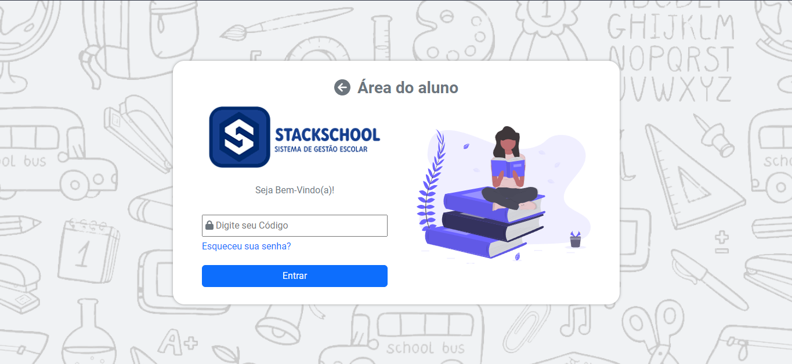

# StackSchool UI

<a href="#"></a>
<a href="#"></a> 

> StackSchool UI project showcase 



## Getting Started

### Prerequisites

You'll need to have a basic knowledge with:
- [React](https://reactjs.org) to manipulate the source-code
- [Vite](https://vitejs.dev/) to manage the development enviroment: 

**Cloning the Repository**

```
$ git clone https://github.com/almeidiano/portfolio

$ cd portfolio
```

**Installing dependencies**

```
$ npm install
```

### Running

With all dependencies installed and the environment properly configured, you can now run the app:

NPM

```
$ npm run dev
```

## Built With

- [React Bootstrap](https://react-bootstrap.github.io/) - The most popular front-end framework, rebuilt for React.
- [Vite ](https://vitejs.dev/) - Is a build tool that aims to provide a faster and leaner development experience for modern web projects

## Author

👤 **Samuel de Almeida**

* Website: [samuelalmeidadev.com.br](https://samuelalmeidadev.com.br/)
* Github: [@almeidiano](https://github.com/almeidiano)
* LinkedIn: [Samuel de Almeida](https://br.linkedin.com/in/samuel-de-almeida)

## 🤝 Contributing

Contributions, issues and feature requests are welcome!

## Show your support

Give a ⭐️ if this project helped you!